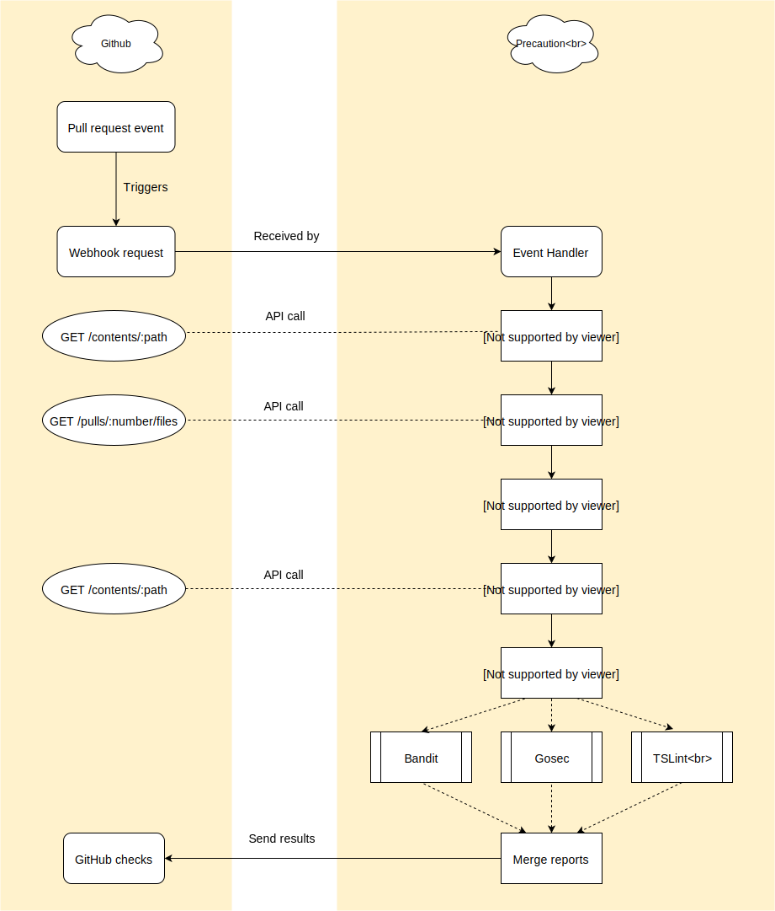

<!--
    Copyright 2019 VMware, Inc.
    SPDX-License-Identifier: BSD-2-Clause
-->

# Overview

Precaution provides simple, automated code reviews for GitHub projects by
running security analysis tools on all Pull Requests. Precaution achieves this
by using a variety of tools under the hood without exposing implementation
details and complexity of the underlying tools to the user.

Concretely, this means that Precaution ignores any tool specific configuration
files which may exist in the project's repository and performs scans based only
on Precaution specific configuration.

# Control Flow

The app subscribes to event related to pull requests (opened, reopened) as well
as manual requests to re-run a check from the GitHub checks tab via the
check_suite.rerequested and check_run.rerequested events.

External API calls to GitHub are made asynchronously to not block the execution
thread.

External linters are spawned asynchronously, their output is redirected to
a file that is then read and converted to the format expected by GitHub checks.

The results are then merged and send back to GitHub with the appropriate status.
