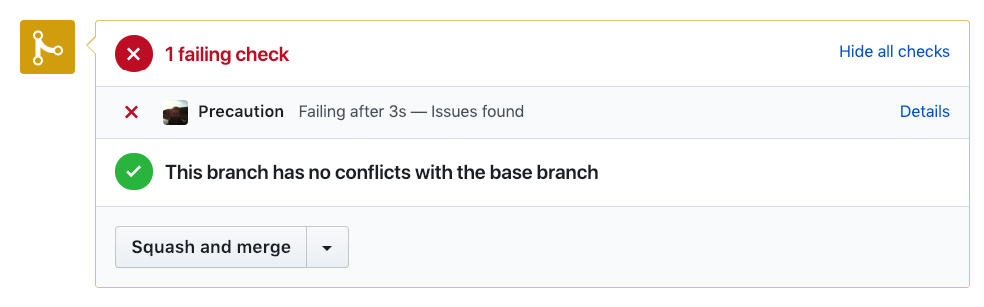
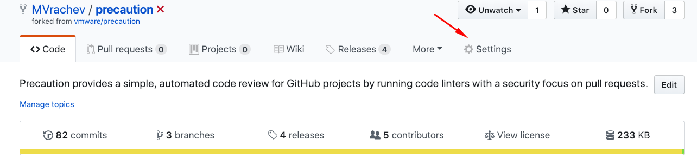

<!--
    Copyright 2019 VMware, Inc.
    SPDX-License-Identifier: BSD-2-Clause
-->

# Initial setup

## Run static code analysis locally (recommended)

Precaution scans new pull requests for security vulnerabilities and if in a pull request there are modifications of old source code it is likely that Precaution will find issues not related with the pull request changes but with the old source code in the modified file.
Therefore for best results, before using Precaution it is recommended to run static code analysis for security problems locally. That way when you resolve the possible issues you can ensure that the current code base does not contain common security issues.

You can run static code analysis of Python source code using Bandit: https://github.com/PyCQA/bandit 

and for source code in Go use Gosec: https://github.com/securego/gosec 

## Setting up a Branch Protection Rule

By default, after Precaution is installed, it will not automatically prevent the merging of a pull request even if the check resulted in a failure status. 

In order to allow Precaution to prevent pull requests from merging, do the following:

### 1. Create a pull request

You should create a pull request after the installation of Precaution in order to setup Precaution as a branch protection rule.

This pull request doesn't have to be merged.

### 2. Go to settings

### 3. Choose branches

### 4. Create a new branch protection rule 

### 5. Setup the branch protection rule 

If you want to apply this rule to the master branch you will have to check the following options:

Congratulations! Now Precaution will prevent the merging of a pull request if the check resulted in a failure status.
