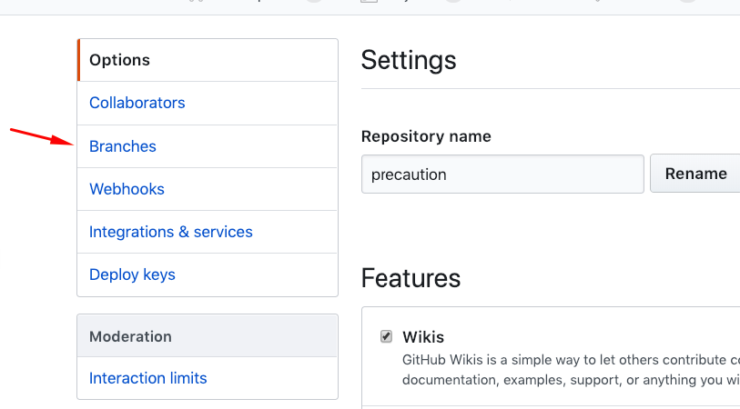
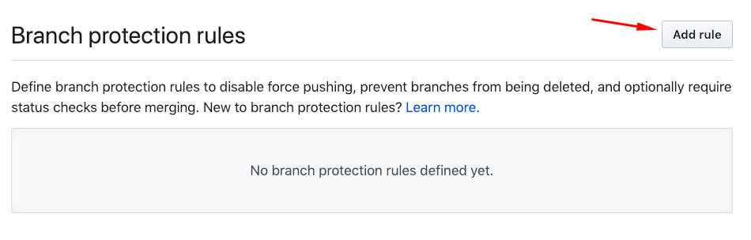

<!--
    Copyright 2019 VMware, Inc.
    SPDX-License-Identifier: BSD-2-Clause
-->

# Setup Precaution as a required check

By default, when Precaution is installed and has access on your project, Precaution creates a check and doesn't stop a pull request from merging even if the result of the check is fail status: 

If you want to make Precaution succeed check mandatory do the following steps:

## 1. Go to settings

## 2. Choose branches

## 3. Create a new branch protection rule 

## 4. Setup the branch protection rule 

If you want to apply this rule to the master branch you will have to fill and click those option:

Now when there is a new pull request Precaution will prohibit it from merging into the master branch until the Precaution check passes successfully.